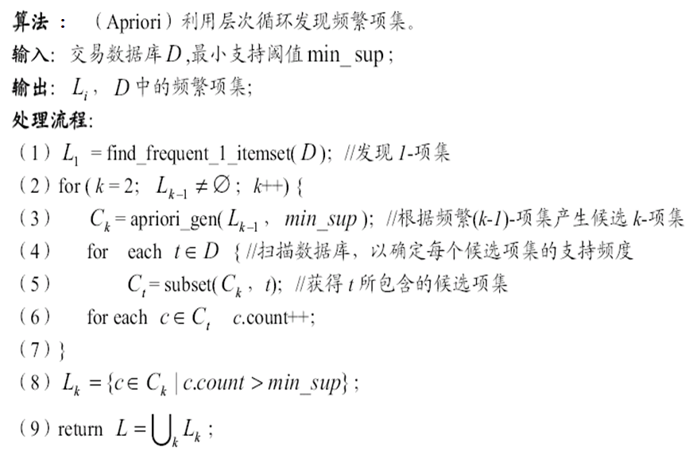

# 关联规则和序列模式
关联规则是数据中一类重要的规则。关联规则挖掘是数据库和数据挖掘社区发明和广泛研究的最重要的模型。它的目标是在数据项之间找到所有的共现关系(称为关联)。

e.g. 关联规则挖掘的经典应用是市场购物篮数据分析，它的目的是发现顾客在超市(或商店)购买的商品是如何关联的。关联规则的一个例子是:
            奶酪 —> 啤酒 [支持度 = 10%, 置信度 = 80%]

规则规定，10%的顾客同时购买奶酪和啤酒，购买奶酪的顾客80%的时间也购买啤酒。这种挖掘模型实际上非常普遍，可以在许多应用中使用。
例如，在Web和文本文档的上下文中，它可以用来查找单词的共现关系和Web使用模式。
在Web使用挖掘中，这些模式对于分析服务器日志中的点击流非常有用。它们也有助于从自然语言文本中发现语言或语言模式。
## 关联规则的基本概念
设I=｛i1,i2,......im｝I=｛i1,i2,......im｝是一个项目（Item）集合(上面的例子中就代表每个商品)，我们以后简称它为总项集。另外在算法操作中，我们会遇到I的子集，对于这些子集，它有n个元素(n<=m)，就称n项集。

T=｛t1，t2，......tn｝T=｛t1，t2，......tn｝是一个（数据库）事务 （Transaction）集合，其中每个事务 ti是一个项目集合，并满足titi属于I。

其中的关联规则如下形式：

X->Y，其中X属于I，Y属于I且X与Y的交集为空，X（或Y）是一个项目的集合，称作项集（Itemset），并称X为前件，Y为后件。  

支持度（support）= X与 Y的同时出现的事务数目/总的T的数目（可用于评价事务的覆盖率，若太小，没有意义）

置信度（confidence）= X与 Y的同时出现的事务数目/仅出现X的事务的数目 （决定规则的可预测度Predictability）

最小支持度（minsup）：预期可以接受的支持度，比这个支持度小的项集将被抛弃。

最小置信度（minconf）：预期可接受的置信度。

**算法的目的是，给定最小支持度和最小置信度，从数据集中找出满足最小支持度和置信度的所有关联规则。** 

## Apriori算法
Apriori算法发现关联规则的过程分为两个步骤。首先通过迭代，检索出事务数据库中的所有频繁项集，即支持度不低于用户设定的阈值的项集。然后利用频繁项集构造出满足用户最小信任度的规则。  
Apriori算法基本思路：采用层次搜索的迭代方法，由候选(k-1)-项集来寻找候选k-项集，并逐一判断产生的候选k-项集是否是频繁的。设Ck是长度为k的候选项集的集合，Lk是长度为k的频繁项集的集合。为了简单，设最小支持度阈值min_sup为最小元组数，即采用最小支持度计数。  
其算法流程如下：
 

### 频繁项集集成
Apriori算法依赖于Apriori或向下闭包特性，有效地集成所有频繁项集。
**向下闭包属性**:如果一个itemset有最小支持，那么这个itemset的每个非空子集也都有最小支持。  
其过程如下：

### 关联规则集成
得到所有的频繁项集以后，可以按照下面的步骤集成关联规则：
（1）对于每个频繁项目集I，集成其所有的非空子集；
（2）对于I的每一个非空子集x，计算conference（x），如果confidence（x）> minconfidence，那么，“x→ （I-x）”成立；
（3）由于规则由频繁项集产生，每个规则都自动满足最小支持度。  
与频繁项集集成相比，规则集成相对简单。集成所有频繁项集f规则,我们使用所有非空的子集f。对于每一次这样的子集α,我们输出的规则形式(f−α)→α,如果   
f.count（或(f−α).count)是f(或(f−α))的支持度。规则的支持度是f.count/n，其中n是事务集中的事务数t。  
所有计算置信度所需的支持度计数都是可用的，因为如果f是频繁的，那么它的任何非空子集也是频繁的，并且在挖掘过程中记录了它的支持度数。因此，在规则集成中不需要数据扫描。然而，这种详尽的规则集成策略是低效的。  
一个高效的算法设计,f在上面置信度的支持度计算α的变化是一样的。它遵循这一规则(f−α)→α,所有规则的形式(f−α sub)→α sub必须也持有,αsubα的一个非空的子集,因为支持度数(f−α sub)必须小于或等于的支持度(f−α)。例如，给定一个itemset {A, B, C, D}，如果规则(A, B→C, D)成立，那么规则(A, B, C→D)和(A, B, D→C)也必须成立。因此,对于一个给定的频繁项目集f,如果与顺向α是一个规则,那么规则与顺向α的子集。这类似于向下闭包属性，如果一个itemset是频繁的，那么它的所有子集都是频繁的。因此，从频繁项集f中，我们首先集成所有规则。然后，我们使用这些规则的结果和candidate-gen()函数来集成所有可能的结果，其中两个项可以出现在一个规则中，以此类推。
其过程如下：  

## 关联规则挖掘的数据格式
将表数据集转换为事务数据集，如果表中的每个属性都接受分类值，那么这将非常简单。或者说只需将每个值更改为一个属性值对。
## 多最小支持度挖掘
### 扩展模型
### 挖掘算法
### 规则集成
## 挖掘类关联规则
### 界定问题
### 挖掘算法
### 多最小支持度挖掘
## 序列模式的基本概念
## 基于GSP的挖掘数据模式
### GSP算法
### 多最小支持度挖掘
## 基于PrefixSpan的挖掘序列模式
### PrefixSPan算法
### 多最小支持度挖掘
## 源于序列模式的集成规则
### 序列规则
### 标签序列规则
### 类序列规则